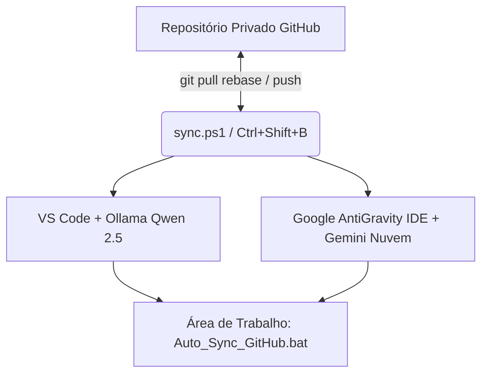

# 🚀 MANUAL E ARQUITETURA DO AMBIENTE DE DESENVOLVIMENTO

> **Arquiteto de Sistemas & DevOps:** Antigravity AI  
> **Identidade Central:** `engallmex@gmail.com`  
> **Usuário GitHub:** `engallmex-ux`  

---

## 📌 1. DIRETRIZES DE INTEROPERABILIDADE E ARQUITETURA

O ambiente foi projetado para rodar de forma agnóstica e sincronizada entre **VS Code** (IA local via Ollama) e **Google AntiGravity IDE** (IA nuvem via Gemini).

---

## 🛠️ 2. COMPONENTES CONFIGURADOS

### 2.1. Sincronização em 1 Clique (`sync.ps1` & `.vscode/tasks.json`)
- **Atalho na IDE:** `Ctrl + Shift + B`
- **Fluxo:**
  1. `git pull origin main --rebase` (Baixa alterações sem criar commits de merge desnecessários).
  2. `git add .` (Indexa código, notas `.md` e fluxos `.json` do n8n).
  3. `git commit -m "Auto Sync: Trabalho finalizado em YYYY-MM-DD HH:mm:ss (engallmex@gmail.com)"`.
  4. `git push origin main`.

### 2.2. Ambiente IA Local (VS Code + Continue + Ollama)
- **Instalador na Área de Trabalho:** `Instalar_AI_Local.bat`
- **Modelos:**
  - **Chat / Refatoração:** `qwen2.5-coder:7b` (Local, 8k context)
  - **Tab Autocomplete:** `qwen2.5-coder:1.5b` (Local, em tempo real)
- **Arquivo de Configuração:** `%USERPROFILE%\.continue\config.json`

### 2.3. Identidade & Segurança
- **Git User Name:** `engallmex-ux`
- **Git User Email:** `engallmex@gmail.com`
- **Isolamento:** Segregação do perfil local do Windows contra vazamento de tokens de sessão da conta central.

---

## 🚦 3. PROCEDIMENTO PARA NOVA MÁQUINA (QUICKSTART)

Caso precise rodar este ambiente em um novo Windows 11:

1. Clone o repositório privado no Windows.
2. Execute o arquivo **`Instalar_AI_Local.bat`** (presente na Área de Trabalho ou na raiz do projeto) para instalar Ollama e modelos.
3. Abra o projeto no **VS Code** ou **Google AntiGravity IDE**.
4. Pressione **`Ctrl + Shift + B`** a qualquer momento para sincronizar todo o trabalho.
