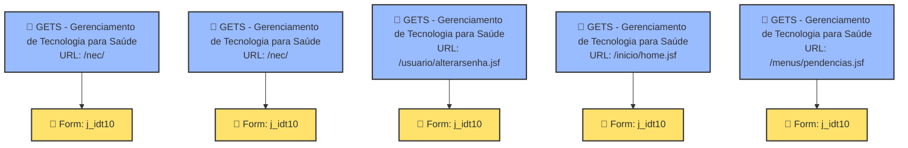

# 🧠 Mapa Mental Arquitetural: gets.ceb.unicamp.br

> **Mapeamento de Engenharia Reversa para Robôs de Automação**

> **Data de Geração:** 21/07/2026 18:08:09

> **URL Alvo:** https://gets.ceb.unicamp.br/nec/

## 📈 Fluxograma da Arquitetura do Site (Mermaid)

---

## 📦 Detalhamento das Páginas, Campos e Seletores

### 1. 📄 Página: GETS - Gerenciamento de Tecnologia para Saúde

- **URL de Acesso:** `https://gets.ceb.unicamp.br/nec/`

#### 📝 Formulário: j_idt10 (Método: `POST`)

##### 🔤 Caixas de Texto, Campos de Entrada e Cadastro

| Label/Campo | Tipo | Seletor do Campo | Placeholder |
| :--- | :--- | :--- | :--- |
| **j_idt10** | `hidden` | `input[name='j_idt10']` | "" |
| **javax.faces.ViewState** | `hidden` | `input#javax.faces.ViewState` | "" |

#### 🔗 Links de Navegação / Menu Encontrados nesta Página

| Texto do Link | URL Destino |
| :--- | :--- |
| GETS | `https://gets.ceb.unicamp.br/nec/` |
| (alterar senha) | `https://gets.ceb.unicamp.br/usuario/alterarsenha.jsf` |
| Página Inicial | `https://gets.ceb.unicamp.br/inicio/home.jsf` |
| Pendências | `https://gets.ceb.unicamp.br/menus/pendencias.jsf` |
| Solicitações | `https://gets.ceb.unicamp.br/menus/solicitacoes.jsf` |
| Cadastros | `https://gets.ceb.unicamp.br/menus/cadastros.jsf` |
| Consultas | `https://gets.ceb.unicamp.br/menus/consultas.jsf` |
| Relatórios | `https://gets.ceb.unicamp.br/menus/relatorios.jsf` |
| Materiais | `https://gets.ceb.unicamp.br/menus/materiais.jsf` |
| Gestão | `https://gets.ceb.unicamp.br/gestao/consulta.jsf` |
| *... e mais 2 links* | |

---

### 2. 📄 Página: GETS - Gerenciamento de Tecnologia para Saúde

- **URL de Acesso:** `https://gets.ceb.unicamp.br/nec/`

#### 📝 Formulário: j_idt10 (Método: `POST`)

##### 🔤 Caixas de Texto, Campos de Entrada e Cadastro

| Label/Campo | Tipo | Seletor do Campo | Placeholder |
| :--- | :--- | :--- | :--- |
| **j_idt10** | `hidden` | `input[name='j_idt10']` | "" |
| **javax.faces.ViewState** | `hidden` | `input#javax.faces.ViewState` | "" |

#### 🔗 Links de Navegação / Menu Encontrados nesta Página

| Texto do Link | URL Destino |
| :--- | :--- |
| GETS | `https://gets.ceb.unicamp.br/nec/` |
| (alterar senha) | `https://gets.ceb.unicamp.br/usuario/alterarsenha.jsf` |
| Página Inicial | `https://gets.ceb.unicamp.br/inicio/home.jsf` |
| Pendências | `https://gets.ceb.unicamp.br/menus/pendencias.jsf` |
| Solicitações | `https://gets.ceb.unicamp.br/menus/solicitacoes.jsf` |
| Cadastros | `https://gets.ceb.unicamp.br/menus/cadastros.jsf` |
| Consultas | `https://gets.ceb.unicamp.br/menus/consultas.jsf` |
| Relatórios | `https://gets.ceb.unicamp.br/menus/relatorios.jsf` |
| Materiais | `https://gets.ceb.unicamp.br/menus/materiais.jsf` |
| Gestão | `https://gets.ceb.unicamp.br/gestao/consulta.jsf` |
| *... e mais 2 links* | |

---

### 3. 📄 Página: GETS - Gerenciamento de Tecnologia para Saúde

- **URL de Acesso:** `https://gets.ceb.unicamp.br/usuario/alterarsenha.jsf`

#### 📝 Formulário: j_idt10 (Método: `POST`)

##### 🔤 Caixas de Texto, Campos de Entrada e Cadastro

| Label/Campo | Tipo | Seletor do Campo | Placeholder |
| :--- | :--- | :--- | :--- |
| **j_idt10** | `hidden` | `input[name='j_idt10']` | "" |
| **javax.faces.ViewState** | `hidden` | `input#javax.faces.ViewState` | "" |

#### 🔗 Links de Navegação / Menu Encontrados nesta Página

| Texto do Link | URL Destino |
| :--- | :--- |
| GETS | `https://gets.ceb.unicamp.br/usuario/alterarsenha.jsf` |
| (alterar senha) | `https://gets.ceb.unicamp.br/usuario/alterarsenha.jsf` |
| Página Inicial | `https://gets.ceb.unicamp.br/inicio/home.jsf` |
| Pendências | `https://gets.ceb.unicamp.br/menus/pendencias.jsf` |
| Solicitações | `https://gets.ceb.unicamp.br/menus/solicitacoes.jsf` |
| Cadastros | `https://gets.ceb.unicamp.br/menus/cadastros.jsf` |
| Consultas | `https://gets.ceb.unicamp.br/menus/consultas.jsf` |
| Relatórios | `https://gets.ceb.unicamp.br/menus/relatorios.jsf` |
| Materiais | `https://gets.ceb.unicamp.br/menus/materiais.jsf` |
| Gestão | `https://gets.ceb.unicamp.br/gestao/consulta.jsf` |
| *... e mais 2 links* | |

---

### 4. 📄 Página: GETS - Gerenciamento de Tecnologia para Saúde

- **URL de Acesso:** `https://gets.ceb.unicamp.br/inicio/home.jsf`

#### 📝 Formulário: j_idt10 (Método: `POST`)

##### 🔤 Caixas de Texto, Campos de Entrada e Cadastro

| Label/Campo | Tipo | Seletor do Campo | Placeholder |
| :--- | :--- | :--- | :--- |
| **j_idt10** | `hidden` | `input[name='j_idt10']` | "" |
| **javax.faces.ViewState** | `hidden` | `input#javax.faces.ViewState` | "" |

#### 🔗 Links de Navegação / Menu Encontrados nesta Página

| Texto do Link | URL Destino |
| :--- | :--- |
| GETS | `https://gets.ceb.unicamp.br/inicio/home.jsf` |
| (alterar senha) | `https://gets.ceb.unicamp.br/usuario/alterarsenha.jsf` |
| Página Inicial | `https://gets.ceb.unicamp.br/inicio/home.jsf` |
| Pendências | `https://gets.ceb.unicamp.br/menus/pendencias.jsf` |
| Solicitações | `https://gets.ceb.unicamp.br/menus/solicitacoes.jsf` |
| Cadastros | `https://gets.ceb.unicamp.br/menus/cadastros.jsf` |
| Consultas | `https://gets.ceb.unicamp.br/menus/consultas.jsf` |
| Relatórios | `https://gets.ceb.unicamp.br/menus/relatorios.jsf` |
| Materiais | `https://gets.ceb.unicamp.br/menus/materiais.jsf` |
| Gestão | `https://gets.ceb.unicamp.br/gestao/consulta.jsf` |
| *... e mais 2 links* | |

---

### 5. 📄 Página: GETS - Gerenciamento de Tecnologia para Saúde

- **URL de Acesso:** `https://gets.ceb.unicamp.br/menus/pendencias.jsf`

#### 📝 Formulário: j_idt10 (Método: `POST`)

##### 🔤 Caixas de Texto, Campos de Entrada e Cadastro

| Label/Campo | Tipo | Seletor do Campo | Placeholder |
| :--- | :--- | :--- | :--- |
| **j_idt10** | `hidden` | `input[name='j_idt10']` | "" |
| **javax.faces.ViewState** | `hidden` | `input#javax.faces.ViewState` | "" |

#### 🔗 Links de Navegação / Menu Encontrados nesta Página

| Texto do Link | URL Destino |
| :--- | :--- |
| GETS | `https://gets.ceb.unicamp.br/menus/pendencias.jsf` |
| (alterar senha) | `https://gets.ceb.unicamp.br/usuario/alterarsenha.jsf` |
| Página Inicial | `https://gets.ceb.unicamp.br/inicio/home.jsf` |
| Pendências | `https://gets.ceb.unicamp.br/menus/pendencias.jsf` |
| Solicitações | `https://gets.ceb.unicamp.br/menus/solicitacoes.jsf` |
| Cadastros | `https://gets.ceb.unicamp.br/menus/cadastros.jsf` |
| Consultas | `https://gets.ceb.unicamp.br/menus/consultas.jsf` |
| Relatórios | `https://gets.ceb.unicamp.br/menus/relatorios.jsf` |
| Materiais | `https://gets.ceb.unicamp.br/menus/materiais.jsf` |
| Gestão | `https://gets.ceb.unicamp.br/gestao/consulta.jsf` |
| *... e mais 2 links* | |

---
