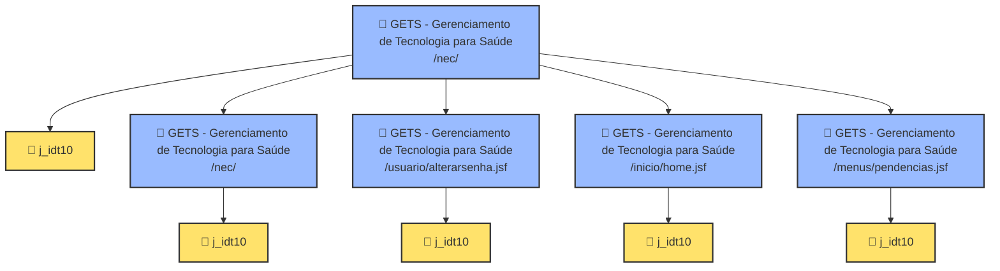

# 🖥️ Painel do Investigador de Sites (Interface de Automação)

Este arquivo é a sua **Interface de Usuário (UI) baseada em Markdown**. Você pode configurar as credenciais do site alvo aqui e me pedir para rodar a análise. Eu lerei as configurações deste painel, executarei a engenharia reversa no site e preencherei os resultados diretamente nas seções correspondentes abaixo.

---

## 📌 1. PAINEL DE CONTROLE (Entradas do Usuário)
*Configure os dados do site que deseja que eu analise:*

* **🌐 URL Inicial do Site:** `https://gets.ceb.unicamp.br/nec/`
* **🔑 Usuário / E-mail:** `lucas.fonseca.4@hubrasil.gov.br`
* **🔒 Senha de Acesso:** `140921`
* **⏱️ Limite de Páginas para Mapear:** `5`
* **👁️ Visualizar Navegador (Modo com Tela):** `Não` (Opções: `Sim`, `Não`)
* **🔍 Método de Varredura:** `Estático` (Opções: `Estático`, `Cliques Reais`)
* **⚙️ Ação Desejada:** `[ ] Executar Análise` *(Marque com 'x' para iniciar)*

---

## 🚦 2. STATUS DA EXECUÇÃO (Atualizado pelo Agente)
*Acompanhe o progresso da análise estrutural:*

* **Estado Atual:** 🟢 **CONCLUÍDO COM SUCESSO**
* **Última Execução:** 2026-07-21 às 18:08:09
* **Arquivos Locais Gerados:**
  * 🗄️ [Esquema JSON do Site](file:///C:/Users/Holter/.gemini/antigravity/scratch/gets_ceb_unicamp_br_schema.json)
  * 🗺️ [Relatório Técnico Detalhado](file:///C:/Users/Holter/.gemini/antigravity/scratch/mapa_mental_gets_ceb_unicamp_br.md)

---

## 🛣️ 2.5 RASTREAMENTO DE FLUXO (De onde para onde?)
*Mapeamento passo-a-passo de cliques de mouse simulados:*

| De qual página (Origem) | Ação / Link Clicado | Seletor de Automação | Leva para onde (Destino) |
| :--- | :--- | :--- | :--- |
| *Nenhuma transição de cliques registrada* | | | |

---

## 🗺️ 3. MAPA MENTAL DA ARQUITETURA (Atualizado pelo Agente)



---

## 🔍 4. DETALHAMENTO DE CAMPOS, BOTÕES E SELETORES (Atualizado pelo Agente)

### 📄 Página: GETS - Gerenciamento de Tecnologia para Saúde (`/nec/`)
#### 📝 Formulário: j_idt10
| Campo do Formulário | Tipo de Elemento | Seletor de Automação (CSS) | Descrição do Campo |
| :--- | :--- | :--- | :--- |
| **j_idt10** | `hidden` | `input[name='j_idt10']` | "" |
| **javax.faces.ViewState** | `hidden` | `input#javax.faces.ViewState` | "" |

### 📄 Página: GETS - Gerenciamento de Tecnologia para Saúde (`/nec/`)
#### 📝 Formulário: j_idt10
| Campo do Formulário | Tipo de Elemento | Seletor de Automação (CSS) | Descrição do Campo |
| :--- | :--- | :--- | :--- |
| **j_idt10** | `hidden` | `input[name='j_idt10']` | "" |
| **javax.faces.ViewState** | `hidden` | `input#javax.faces.ViewState` | "" |

### 📄 Página: GETS - Gerenciamento de Tecnologia para Saúde (`/usuario/alterarsenha.jsf`)
#### 📝 Formulário: j_idt10
| Campo do Formulário | Tipo de Elemento | Seletor de Automação (CSS) | Descrição do Campo |
| :--- | :--- | :--- | :--- |
| **j_idt10** | `hidden` | `input[name='j_idt10']` | "" |
| **javax.faces.ViewState** | `hidden` | `input#javax.faces.ViewState` | "" |

### 📄 Página: GETS - Gerenciamento de Tecnologia para Saúde (`/inicio/home.jsf`)
#### 📝 Formulário: j_idt10
| Campo do Formulário | Tipo de Elemento | Seletor de Automação (CSS) | Descrição do Campo |
| :--- | :--- | :--- | :--- |
| **j_idt10** | `hidden` | `input[name='j_idt10']` | "" |
| **javax.faces.ViewState** | `hidden` | `input#javax.faces.ViewState` | "" |

### 📄 Página: GETS - Gerenciamento de Tecnologia para Saúde (`/menus/pendencias.jsf`)
#### 📝 Formulário: j_idt10
| Campo do Formulário | Tipo de Elemento | Seletor de Automação (CSS) | Descrição do Campo |
| :--- | :--- | :--- | :--- |
| **j_idt10** | `hidden` | `input[name='j_idt10']` | "" |
| **javax.faces.ViewState** | `hidden` | `input#javax.faces.ViewState` | "" |


---

## 🛠️ 5. CÓDIGO DO ROBÔ GERADO (Pronto para Automação Local)
*Use este template básico em Python + Playwright criado com os seletores identificados acima:*

```python
import os
from playwright.sync_api import sync_playwright

def run_robot():
    url = "https://gets.ceb.unicamp.br/nec/"
    
    with sync_playwright() as p:
        browser = p.chromium.launch(headless=False) # Visível para testes
        page = browser.new_page()
        
        # 1. Login Seguro
        page.goto(url)
        page.fill("input[name='j_username']", "lucas.fonseca.4@hubrasil.gov.br")
        page.fill("input[name='j_password']", "140921")
        page.click("input[type='submit'][value='Entrar']")
        page.wait_for_load_state("networkidle")
        
        # 2. Navega para Abertura de OS
        page.goto("https://gets.ceb.unicamp.br/nec/view/manutencaocorretiva/abertura.jsf")
        
        # 3. Preenchimento de Exemplo
        page.fill("input[name='fm:acSolicitante_input']", "TÉCNICO DE PLANTÃO")
        page.fill("input[name='fm:txtTelefone']", "4321")
        page.fill("input[name='fm:acEquipamento_input']", "987654") # Patrimônio
        page.fill("input[name='fm:acOrgao_input']", "UTI ADULTO")
        page.select_option("select[name='fm:cmbPrioridades_input']", label="Normal")
        page.fill("textarea[name='fm:txtDescricao']", "Equipamento não liga após oscilação de energia.")
        
        print("[✓] Campos preenchidos localmente com segurança utilizando a árvore mapeada!")
        # page.click("input[type='submit'][value='Solicitar Abertura OS']") # Descomente para enviar
        
        browser.close()

if __name__ == "__main__":
    run_robot()
```
